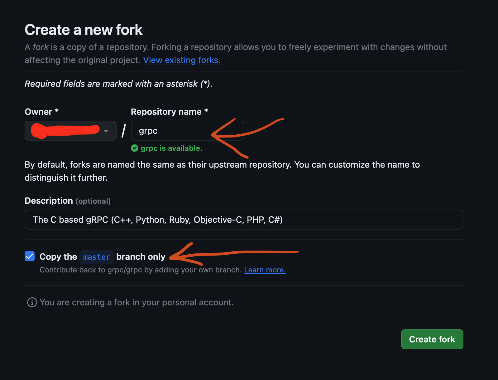
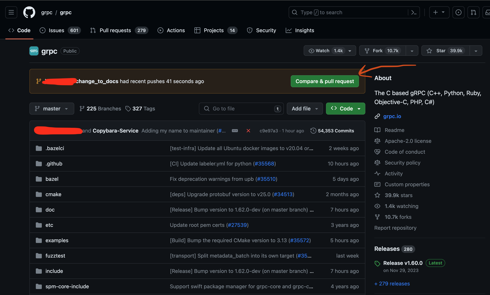
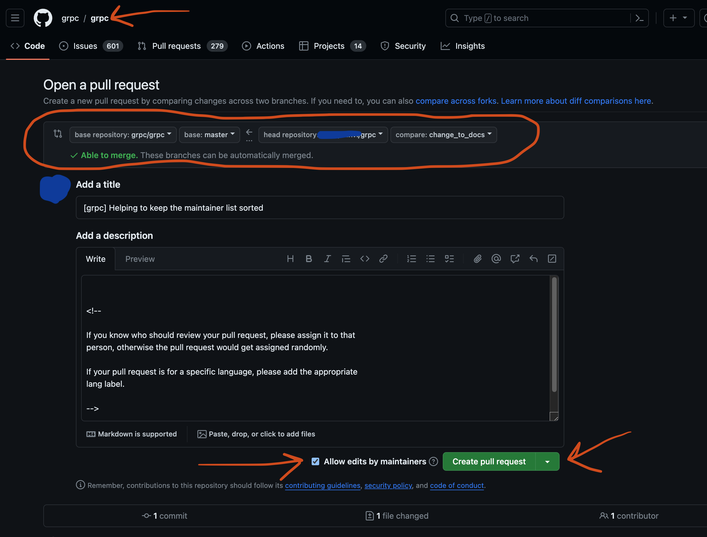
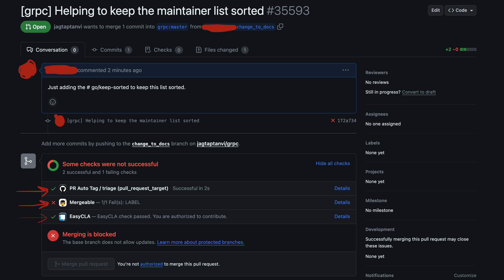

# Contributing to gRPC - Step By Step Guide

> This document is not meant for Google employees.

## Prerequisite

To contribute to the grpc codebase, you will need the following

1.  An
    [active Github account](https://docs.github.com/en/get-started/quickstart/creating-an-account-on-github)
1.  [Understanding of Git and Github](https://docs.github.com/en/get-started/using-git/about-git)
1.  [Knowing how to fork a repository, clone a repository, merge, rebase,
    resolve, push, pull, fetch
    etc](https://docs.github.com/en/get-started/using-git/about-git)
1.  [git installed and working on your machine](https://github.com/git-guides/install-git)
1.  Knowledge of any of the languages being used - C++, Python, Ruby,
    Objective-C, PHP, C#

## Steps to Contribute gRPC C++ Code

Github Repository for the C based gRPC (C++, Python, Ruby, Objective-C, PHP, C#)
https://github.com/grpc/grpc

### Fork and Clone the

If you want to contribute to the gRPC code base, you need to make a fork.

Create your
[own fork](https://docs.github.com/en/pull-requests/collaborating-with-pull-requests/working-with-forks/fork-a-repo)
from https://github.com/grpc/grpc

Then
[clone your fork](https://docs.github.com/en/pull-requests/collaborating-with-pull-requests/working-with-forks/fork-a-repo#cloning-your-forked-repository)
on your local machine.

### Prepare your commit

*   In your cloned repository, create a new branch from master.
*   Then prepare a commit for the files that you want to contribute. Commit to
    this branch.
*   Push the commit to your fork on Github.

Take care that your commits are aligned with these
[guidelines](https://github.com/grpc/grpc/blob/master/CONTRIBUTING.md#guidelines-for-pull-requests)

### Prepare a Pull Request

After pushing your commit, visit link https://github.com/grpc/grpc . If the
forking, branch creation, commit and push have been successful, you will see a
message as follows

Take care to allow edits by maintainers. This way, if there is a specific issue
with your PR, the maintainer can help with it if needed. This will reduce
turnaround time for submission.

Create a Pull Request.

### Pull Request Status - Safe Review

Once the pull request is ready, you will need to wait for a reviewer to be
assigned to your Pull Request.

After a few hours, you will notice a new "assignee" assigned to the Pull
Request. After a reviewer is assigned to you, they will help with the further
steps.

You will need to

1.  Complete the code review and address the comments.
1.  Your reviewer may add a few labels as needed.

### Pull Request Status - Green

Once you have an approval from reviewer, check if the tests are running. After
the tests are complete, take a look at the status of all the tests. If
everything is green, everything is good. But that is usually not the case. If
there are failures, click on each failure. It will take you to the page where
the details of the error will be visible. Try to fix the issue.

### Pull Request Approval

For Pull Request which are are non-trivial, the code review process is thorough.
You can read more about the process and requirements
[here](https://github.com/grpc/grpc/blob/master/CONTRIBUTING.md#guidelines-for-pull-requests).

After you fix the code review, you will finally get an approval. After getting
approval the Pull Request can be submitted.

### Submission

Submission/Merge of the Pull Request **cannot** be done via Github.

After you have an approval from a reviewer, the process of submission will be
triggered by a Google employee. When the submission happens

1.  A commit having your changes, with a few additional formatting changes will
    be committed to the grpc/master branch.
1.  The original Pull Request you created will be closed.

<!-- TODO add screenshot of PR that is closed -->
<!-- TODO add screenshot of commit made by copybara -->
